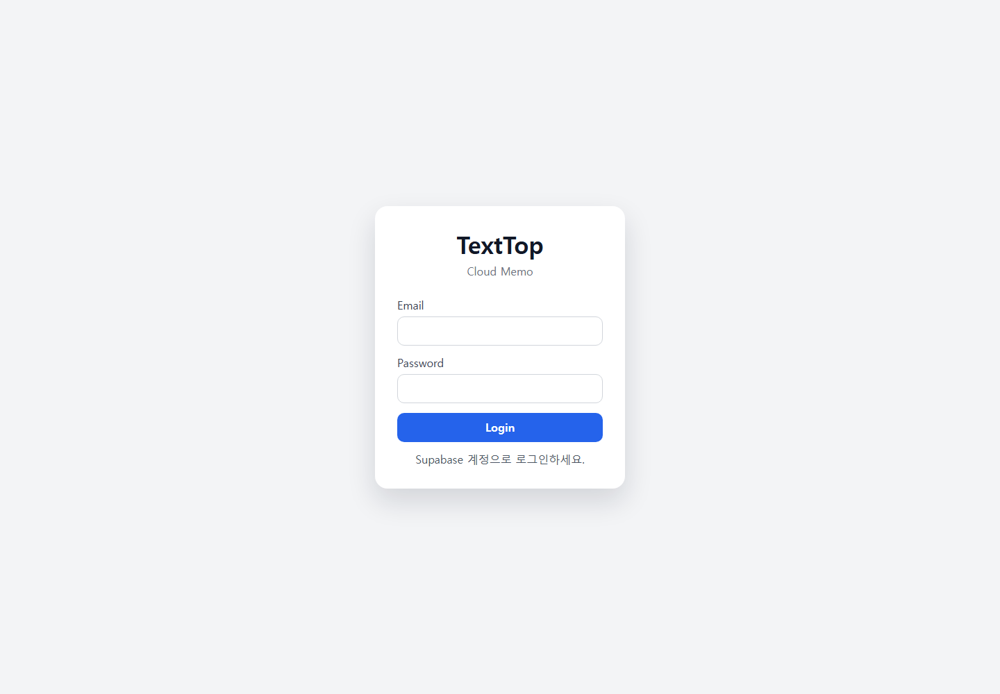

# MyNewTextTop

MyNewTextTop is a cloud memo app that lets the same memo data be used from both a Windows desktop app and a web browser. The two clients share Supabase Auth and the same Supabase `memos` table, so memos saved on one side can be loaded on the other side.

Live web app:

https://justkiwon.github.io/MyNewTextTop/

## Screenshot



## What It Does

- Login with a Supabase email/password account.
- Create, edit, save, and soft-delete memos.
- Keep memo data shared between desktop and web.
- Save desktop memo window position, size, Topmost state, and open state.
- Cache desktop changes locally when the network or Supabase is unavailable.
- Protect concurrent edits with a memo `version` and `baseVersion` conflict check.
- Edit rich text formatting in memo content, including strikethrough and font size.

## Clients

### Windows Desktop

Path:

```text
TextTop/desktop/TextTop.Desktop
```

The desktop app is a .NET 8 WPF app. It supports multiple memo windows, Topmost mode, offline local cache, pending sync, conflict detection, and rich text editing through WPF `RichTextBox`.

Run locally:

```powershell
cd TextTop/desktop/TextTop.Desktop
dotnet restore
dotnet build
dotnet run
```

Publish for Windows:

```powershell
dotnet publish -c Release -r win-x64 --self-contained false
```

If the target PC does not have the .NET runtime installed:

```powershell
dotnet publish -c Release -r win-x64 --self-contained true
```

Desktop config is loaded from one of these local-only files:

```text
%AppData%/TextTop/config.json
TextTop/desktop/TextTop.Desktop/appsettings.json
```

Example:

```json
{
  "supabaseUrl": "https://YOUR_PROJECT_REF.supabase.co",
  "supabaseAnonKey": "YOUR_SUPABASE_ANON_OR_PUBLISHABLE_KEY"
}
```

### Web

Path:

```text
TextTop/web/texttop-web
```

The web app is React + TypeScript + Vite. It uses Supabase Auth in the browser, displays a memo list and editor, and saves formatted memo HTML back to Supabase.

Run locally:

```powershell
cd TextTop/web/texttop-web
npm install
npm run dev
```

Build:

```powershell
npm run build
```

Local web config belongs in:

```text
TextTop/web/texttop-web/.env
```

Example:

```env
VITE_SUPABASE_URL=https://YOUR_PROJECT_REF.supabase.co
VITE_SUPABASE_ANON_KEY=YOUR_SUPABASE_ANON_OR_PUBLISHABLE_KEY
```

## Supabase

Database setup files are in:

```text
TextTop/supabase
```

Use `TextTop/supabase/supabase_schema.sql` to create the `public.memos` table, indexes, trigger, and Row Level Security policies.

The app is designed around these rules:

- The browser and desktop app use only the Supabase anon/publishable key.
- The `service_role` key must never be placed in the browser, WPF app, repo, or GitHub Actions logs.
- Supabase RLS keeps each user limited to rows where `owner_id = auth.uid()`.

## GitHub Pages Deployment

This repo includes a GitHub Actions workflow:

```text
.github/workflows/deploy-web.yml
```

The workflow builds `TextTop/web/texttop-web` and deploys the Vite `dist` folder to GitHub Pages.

Required repository secrets:

```text
VITE_SUPABASE_URL
VITE_SUPABASE_ANON_KEY
```

Set them in:

```text
GitHub repository -> Settings -> Secrets and variables -> Actions
```

Then set Pages to:

```text
Settings -> Pages -> Build and deployment -> Source: GitHub Actions
```

## Public Repository Safety Check

This project is safe to make public as long as only the current tracked files are published.

Confirmed local-only files:

- `TextTop/web/texttop-web/.env`
- `TextTop/desktop/TextTop.Desktop/appsettings.json`
- `%AppData%/TextTop/config.json`
- `%AppData%/TextTop/AuthToken.json`
- `%AppData%/TextTop/MemosCache.json`

The repo tracks only example placeholders such as:

```text
YOUR_PROJECT_REF
YOUR_SUPABASE_ANON_OR_PUBLISHABLE_KEY
```

Before making the repo public, make sure:

- GitHub does not show `.env` or `appsettings.json`.
- GitHub Secrets contain the Supabase values instead of committed files.
- Supabase RLS is enabled.
- No `service_role` or secret key was ever committed.

## Project Structure

```text
.
├─ .github/workflows/deploy-web.yml
├─ NewMemoTextTop.sln
├─ TextTop
│  ├─ desktop/TextTop.Desktop
│  ├─ docs/images
│  ├─ supabase
│  └─ web/texttop-web
└─ README.md
```

## Notes

- Manual save is intentional. Text edits, title edits, window moves, and Topmost changes are saved when pressing `SAVE` or closing a desktop memo window.
- Conflict protection prevents one client from silently overwriting another client's newer memo version.
- Rich text content is stored as HTML fragments, for example `<s>text</s>` for strikethrough and `<span style="font-size: ...">text</span>` for font size.
